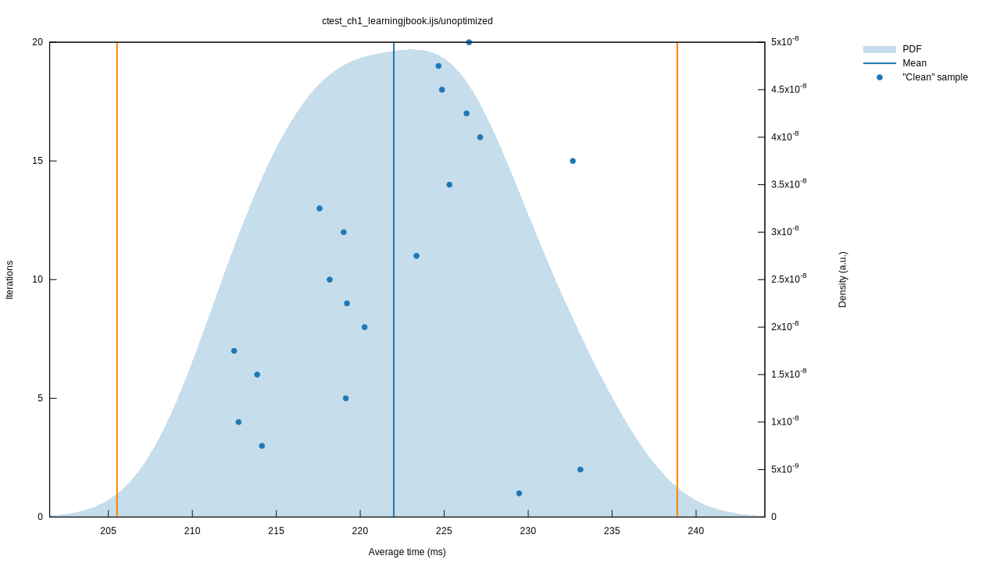
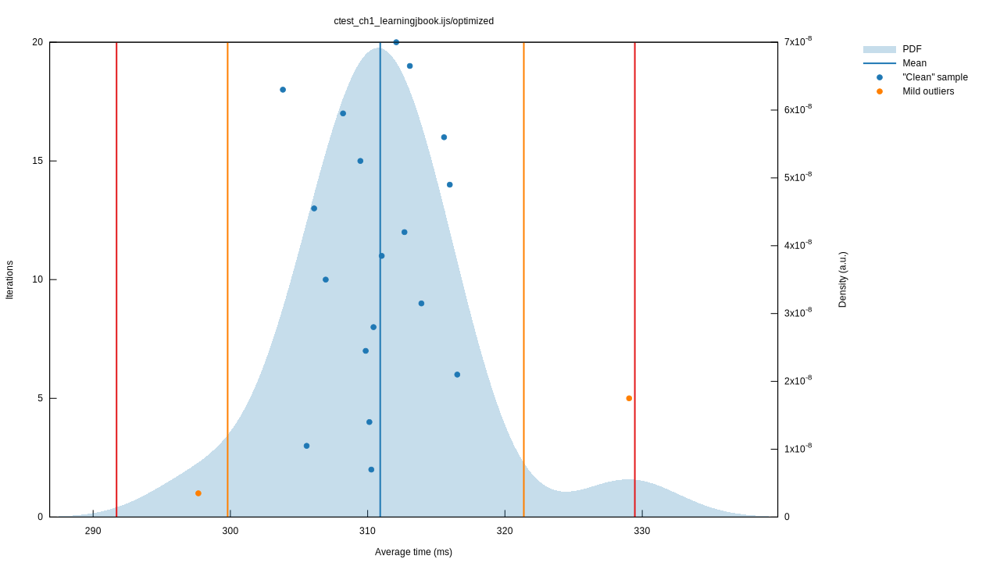

# jcompiler

[](https://crates.io/crates/jcompiler)
[](https://travis-ci.com/mattjquinn/jcompiler)
[](https://coveralls.io/github/mattjquinn/jcompiler)
[](https://github.com/Aaronepower/tokei)

A compiler for the J programming language.

### Compiling J

You will need LLVM 7 and Rust installed.

    $ cargo build --release

You can then compile and run programs as follows:

```
$ target/release/jcompiler <jfile>.ijs
$ ./<jfile>
```

### Examples

You can find many examples of J programs in the `jlang_programs` directory.
As one example, compiling this J program:

```j
'Some array operations...'
*: 1 2 3 4
1 2 3 + 10 20 30
1 + 10 20 30
1 2 3 + 10
residues =: 2 | 0 1 2 3 4 5 6 7
residues
```

with jcompiler and running the compiled binary will yield the following on stdout:

```j
Some array operations...
1 4 9 16
11 21 31
11 21 31
11 12 13
0 1 0 1 0 1 0 1
```

By default, jcompiler compiles programs to executables that run on the
current machine. You can explicitly specify architecture using LLVM
target triples:

```
$ target/release/jcompiler <jfile>.ijs --target=x86_64-pc-linux-gnu
```

### Documentation

The latest API reference for the master branch is [available here](https://mattjquinn.github.io/jcompiler/master/jcompiler/index.html).

### Tests

There are two categories of tests: one for the parser, the other for the compiler. Both sets can be run with:

```
$ cargo test
```

### Benchmarks

At present, only the compilation process itself is benchmarked. Future benchmarks
for compiled binaries themselves are planned. You can run the compiler benchmarks by invoking:

```sh
$ cargo bench
```

If you have `gnuplot` installed, graphs will be generated as part of the report.
Here's a look at how the compiler runs with optimizations turned off:



compared with all optimizations turned on:



as of March 30th, 2019.

